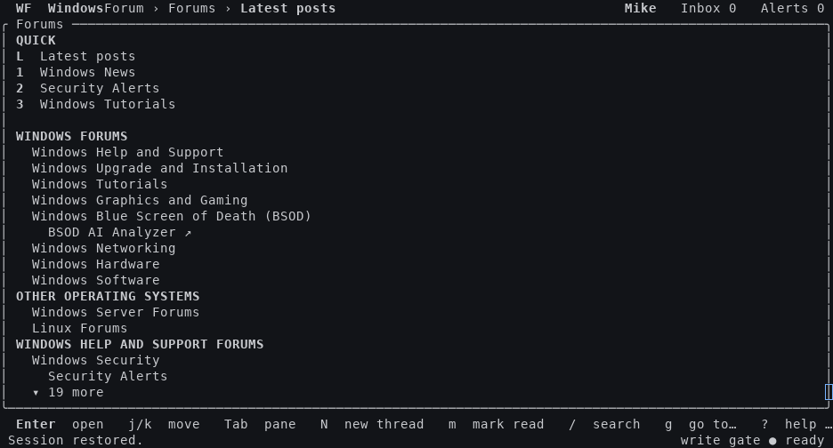

# Forum Terminal (TUI)

A terminal client for [XenForo 2.3](https://xenforo.com) forums: browse, read and post threads, send conversation messages, check alerts, search — with inline images, drafts shared with the website's editor, and a self-updater. Pure Rust, runs locally or over SSH, mouse and keyboard.

Two editions build from this one repo:

| Edition | For | Get it with |
|---|---|---|
| **Forum Terminal (TUI)** | windowsforum.com built in — no config needed | default assets, no `-xf` |
| **Terminal for XenForo** | any other XenForo 2.3 forum | assets with `-xf`, or `--no-default-features --features images` |

The command is `wftui` in both.

<p align="center">
  
</p>

## Install

**Linux (x86_64 / aarch64)**

```sh
curl -fsSL https://raw.githubusercontent.com/faratech/forumtui/main/packaging/install.sh | sh
```

**Windows (x64 / x86 / arm64) — PowerShell**

```powershell
irm https://raw.githubusercontent.com/faratech/forumtui/main/packaging/install.ps1 | iex
```

or install the signed **MSIX** from a release (`Add-AppxPackage .\wftui-<version>.msixbundle`) — that is the recommended Windows path and puts `wftui.exe` on your PATH via an execution alias.

Both scripts pick the latest GitHub release, verify the download against the release's `SHA256SUMS.txt`, and install to a bin dir of your choosing:

```sh
WFTUI_EDITION=xf sh install.sh            # Terminal for XenForo edition
WFTUI_INSTALL_DIR=/opt/bin sh install.sh  # where to put the binary
.\install.ps1 -Edition xf -InstallDir D:\tools
```

Other ways in:

- **Manual**: grab `wftui-<version>-<platform>` (or the `.tar.gz`) from [Releases](https://github.com/faratech/forumtui/releases) and check its sha256 against `SHA256SUMS.txt`.
- **From source**: `cargo install --path wftui` (Rust 1.98+; no C toolchain needed anywhere).
- **macOS**: no build ships yet — `sh install.sh` will say so.

## Sign in

Run `wftui`. With the built-in site there is nothing to configure — choose **Sign in** and the client offers a short link you can open on any device (including a phone while connected over SSH), a loopback redirect for a local browser, or a pasted redirect. Sessions refresh silently; tokens live at `~/.config/wftui/token.json` (`%APPDATA%\wftui` on Windows).

## Connect it to your own forum

Any XenForo 2.3 forum works; the admin creates one **public PKCE OAuth client** in the Admin CP (`http://127.0.0.1/callback` as the redirect URI, standard scopes listed in the docs), and users point the client at it:

- the **-xf edition** asks for the forum address and client ID on first run, or
- write `~/.config/wftui/config.json` (`wftui --init-config` writes an annotated example) and list as many forums as you like; `wftui <sitename>` picks one.

Full details, including the optional [TuiLink](addon/README.md) add-on (short sign-in links + draft relay): **[docs/CONFIG.md](docs/CONFIG.md)**.

## Notes

- Needs a UTF-8 terminal; images use kitty/sixel/iTerm2 protocols when the terminal supports them and fall back to half-blocks or text.
- The client self-updates in place (`g u` to check now); it verifies every download before staging it.
- Anything on the wire is self-throttled — be polite to your forum.
- MIT — see [LICENSE](LICENSE). Issues and PRs welcome.
